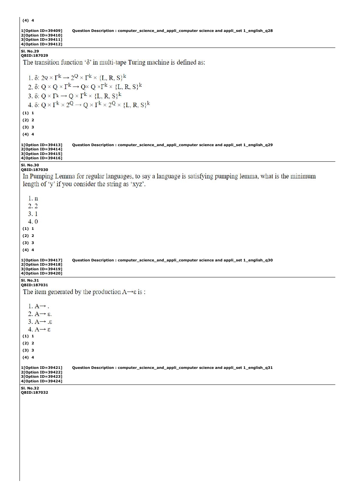

# Question 79

*UGC NET CS · 2023 Mar 11 Shift 2 Dec 2022 Session · Turing Machines · Recursive and Recursively Enumerable Languages*

The transition function δ in a multi-tape Turing machine is defined as:

- **1.** δ: 2^Q × Γ^k → 2^Q × Γ^k × {L, R, S}^k
- **2.** δ: Q × Q × Γ^k → Q × Q × Γ^k × {L, R, S}^k
- **3.** δ: Q × Γ^k → Q × Γ^k × {L, R, S}^k
- **4.** δ: Q × Γ^k × 2^Q → Q × Γ^k × 2^Q × {L, R, S}^k

> [!TIP]
> **Correct answer: 3. δ: Q × Γ^k → Q × Γ^k × {L, R, S}^k**

## Solution

A deterministic k-tape Turing machine reads one tape symbol from each of its k tapes, so its input to δ is a state in Q and a k-tuple in Γ^k. One transition selects the next state, writes one symbol on each tape, and chooses one movement L, R, or S for each head. Thus δ: Q×Γ^k → Q×Γ^k×{L,R,S}^k.

## Key Points

- For k tapes, both the symbols read/written and the head movements are k-tuples.

## Why the other options are incorrect

The powerset 2^Q is associated with sets of states in nondeterministic constructions, not an ordinary deterministic transition. Adding a second Q or both Q and 2^Q introduces components that a multi-tape step does not consume or produce.

## Question Figure

