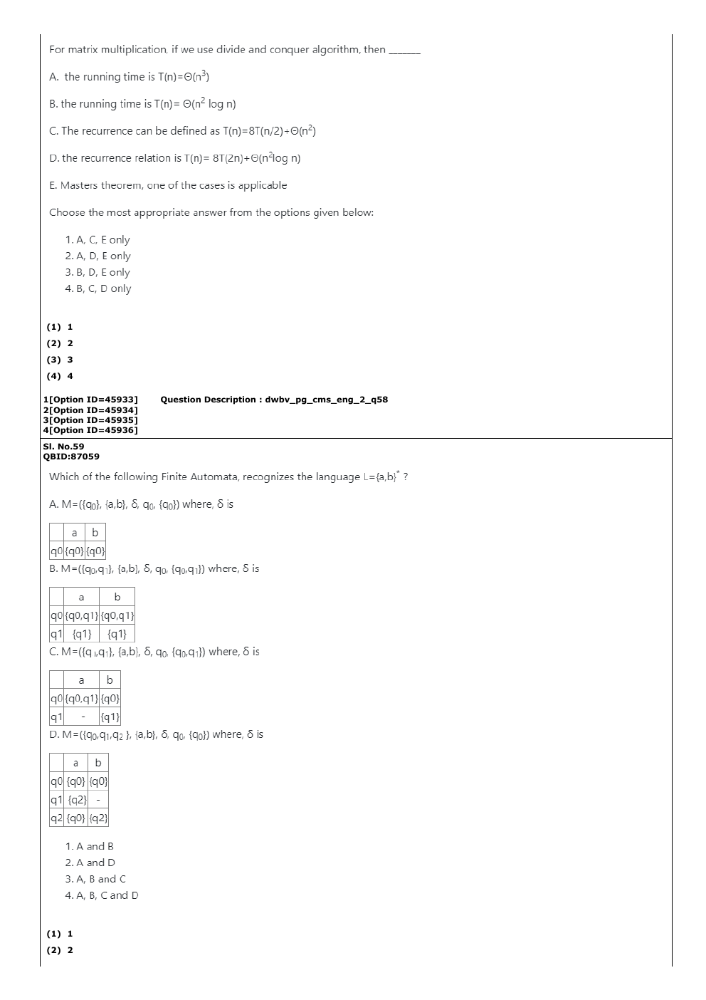

# Question 109

*UGC NET CS · 2023 Mar 15 Shift 1 Dec 2022 Session · Regular Language Models · Grammars and Expressions*

Which of the following finite automata recognize the language L = {a, b}*? A. M = ({q0}, {a,b}, δ, q0, {q0}), where δ(q0,a)={q0} and δ(q0,b)={q0}. B. M = ({q0,q1}, {a,b}, δ, q0, {q0,q1}), where δ(q0,a)={q0,q1}, δ(q0,b)={q0,q1}, δ(q1,a)={q1}, and δ(q1,b)={q1}. C. M = ({q0,q1}, {a,b}, δ, q0, {q0,q1}), where δ(q0,a)={q0,q1}, δ(q0,b)={q0}, δ(q1,a)=∅, and δ(q1,b)={q1}. D. M = ({q0,q1,q2}, {a,b}, δ, q0, {q0}), where δ(q0,a)={q0}, δ(q0,b)={q0}, δ(q1,a)={q2}, δ(q1,b)=∅, δ(q2,a)={q0}, and δ(q2,b)={q2}.

- **1.** A and B
- **2.** A and D
- **3.** A, B and C
- **4.** A, B, C and D

> [!TIP]
> **Correct answer: 4. A, B, C and D**

## Solution

A's sole accepting state loops on both symbols. B and C always retain an accepting q0 path for every prefix. D also has accepting q0 looping on both symbols; q1,q2 are unreachable and irrelevant. Hence all four accept every string over {a,b}, including ε.

## Key Points

- For an NFA, one accepting computation suffices; unreachable states do not change the language.

## Why the other options are incorrect

Options 1–3 omit at least one automaton that still has an accepting path for every input.

## Question Figure

