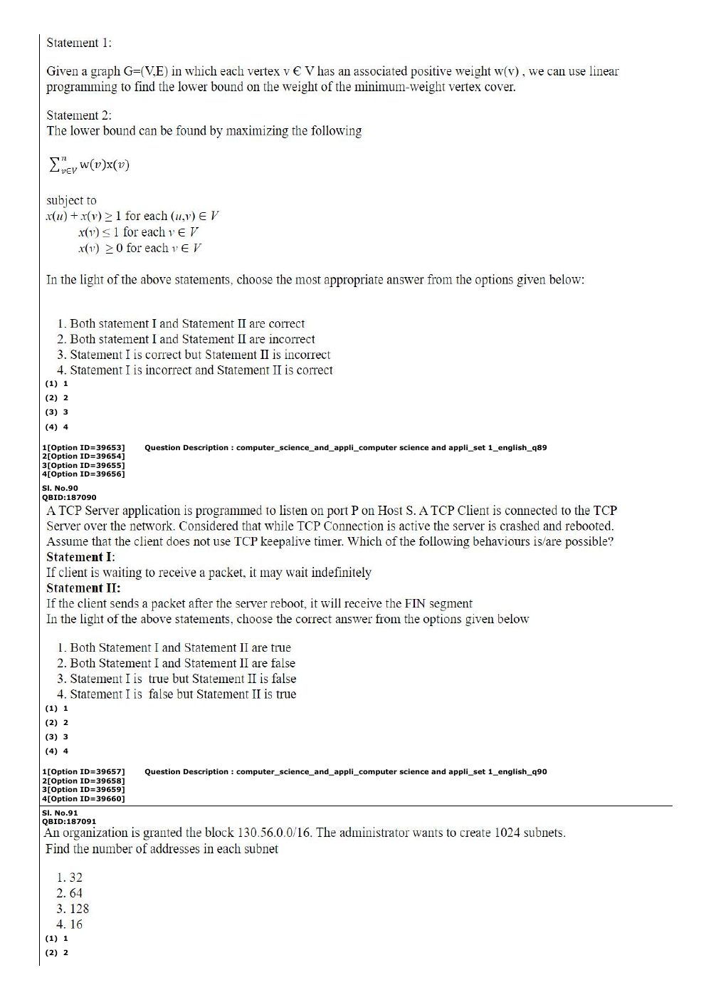

# Question 141

*UGC NET CS · 2023 Mar 11 Shift 2 Dec 2022 Session · Network Models · Port and Specific Addresses*

An organization is granted the block 130.56.0.0/16. The administrator wants to create 1024 subnets. Find the number of addresses in each subnet.

- **1.** 32
- **2.** 64
- **3.** 128
- **4.** 16

> [!TIP]
> **Correct answer: 2. 64**

## Solution

A /16 block contains 2^(32−16)=65,536 addresses. Dividing it into 1024=2^10 equal subnets leaves 2^(16−10)=2^6=64 addresses per subnet.

## Key Points

- Addresses per equal subnet = original block size ÷ number of subnets.

## Why the other options are incorrect

32 and 16 borrow too many host bits; 128 borrows too few.

## Question Figure

