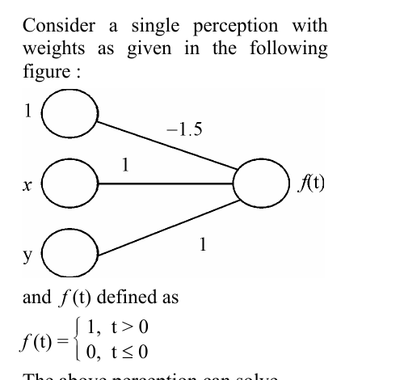

# Question 75

*UGC NET CS · 2013 June Paper 3 · Neural Networks · Perceptron Decision Boundaries*

Consider a single perceptron with bias input 1 of weight −1.5, inputs x and y each of weight 1, and activation f(t)=1 for t>0 and 0 for t≤0. The perceptron can solve

- **A.** OR problem
- **B.** AND problem
- **C.** XOR problem
- **D.** All of the above

> [!TIP]
> **Correct answer: B. AND problem**

## Solution

The perceptron's net input is t=−1.5+x+y. For binary inputs, (0,0) gives −1.5, (1,0) and (0,1) each give −0.5, and (1,1) gives 0.5. With f(t)=1 only when t>0, the outputs are 0,0,0,1. That is exactly the AND truth table.

## Key Points

- Evaluate bias plus weighted inputs on all four binary cases; threshold −1.5+x+y implements AND.

## Why the other options are incorrect

OR would need output 1 for the single-1 inputs, but their net value is −0.5. XOR would require the two single-1 inputs to produce 1 and (1,1) to produce 0; one linear threshold cannot do that. Therefore it cannot solve all three.

## Question Figure

