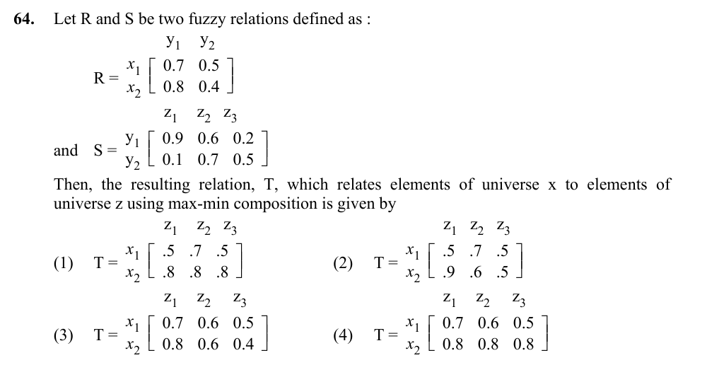

# Question 64

*UGC NET CS · 2016 July Paper 3 · Fuzzy Sets · Max-min composition of fuzzy relations*

Let R = [[0.7, 0.5], [0.8, 0.4]] and S = [[0.9, 0.6, 0.2], [0.1, 0.7, 0.5]] be fuzzy relations. Which matrix T = R ∘ S results from max-min composition?

- **1.** T = [[0.5, 0.7, 0.5], [0.8, 0.8, 0.8]]
- **2.** T = [[0.5, 0.7, 0.5], [0.9, 0.6, 0.5]]
- **3.** T = [[0.7, 0.6, 0.5], [0.8, 0.6, 0.4]]
- **4.** T = [[0.7, 0.6, 0.5], [0.8, 0.8, 0.8]]

> [!TIP]
> **Correct answer: 3. T = [[0.7, 0.6, 0.5], [0.8, 0.6, 0.4]]**

## Solution

For max-min composition, t_ij = max_k min(r_ik,s_kj). Compute the first row: t_11=max(min(0.7,0.9),min(0.5,0.1))=max(0.7,0.1)=0.7; t_12=max(0.6,0.5)=0.6; t_13=max(0.2,0.5)=0.5. For the second row: t_21=max(0.8,0.1)=0.8; t_22=max(0.6,0.4)=0.6; t_23=max(0.2,0.4)=0.4. Hence T=[[0.7,0.6,0.5],[0.8,0.6,0.4]], which is option 3.

## Key Points

- Fuzzy relational composition replaces ordinary multiply-and-add by min-along-a-path and max-across-paths.

## Why the other options are incorrect

The other matrices contain entries that cannot result from taking the minimum along each y-path and then the maximum across those paths. In particular, values such as 0.8 in the second-row z2 or z3 positions exceed every available path minimum.

## Question Figure

