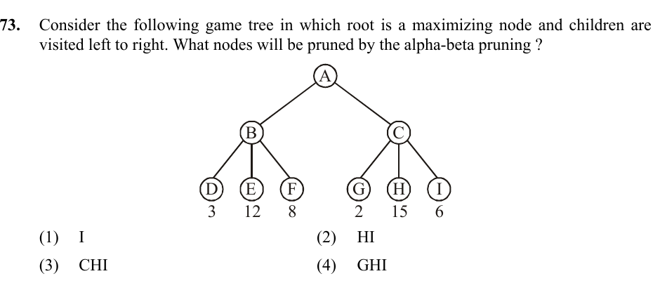

# Question 73

*UGC NET CS · 2016 July Paper 3 · Adversarial Search · Alpha-Beta Pruning*

In the displayed game tree, the root is a maximizing node and children are visited from left to right. Which nodes will alpha-beta pruning remove?

- **1.** I
- **2.** HI
- **3.** CHI
- **4.** GHI

> [!TIP]
> **Correct answer: 2. HI**

## Solution

A is MAX and its children B and C are MIN nodes. Evaluating B from left to right gives min(3,12,8)=3, so A's current alpha becomes 3. At C, the first examined child G has value 2, making C's beta equal to 2. Because beta≤alpha (2≤3), MAX would never choose C over the already available value 3, regardless of C's remaining children. The branches to H and I are therefore pruned. This is option 2.

## Key Points

- At a MIN node, prune remaining children as soon as beta≤the alpha inherited from a MAX ancestor.

## Why the other options are incorrect

I alone understates the cutoff: both unvisited siblings H and I are skipped. C itself and G must be visited before the cutoff can be established, so CHI and GHI are incorrect.

## Question Figure

