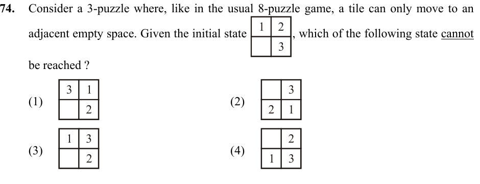

# Question 74

*UGC NET CS · 2016 July Paper 3 · Heuristic Search · Sliding-Puzzle Reachability and Parity*

Consider a 3-puzzle in which a tile can move only into an adjacent empty space. From the initial state [[1, 2], [blank, 3]], which state cannot be reached?

- **1.** [[3, 1], [blank, 2]]
- **2.** [[blank, 3], [2, 1]]
- **3.** [[1, 3], [blank, 2]]
- **4.** [[blank, 2], [1, 3]]

> [!TIP]
> **Correct answer: 3. [[1, 3], [blank, 2]]**

## Solution

For a 2×2 sliding puzzle, reachability preserves the parity of (number of inversions among the numbered tiles + blank row counted from the bottom). The initial state [1,2; blank,3] has 0 inversions and blank-row value 1, so the invariant is odd. Option 1 has 2+1=3, option 2 has 3+2=5, and option 4 has 1+2=3; all are odd and therefore reachable. Option 3, [1,3; blank,2], has one inversion and blank-row value 1, totaling 2, which is even. It lies in the other parity class and cannot be reached.

## Key Points

- On an even-width sliding puzzle, compare the parity of inversions plus the blank's row from the bottom.

## Why the other options are incorrect

The other three states have the same solvability parity as the initial state. A sequence of legal blank moves can reach each of them; visual similarity or tile order alone is not a reliable test.

## Question Figure

