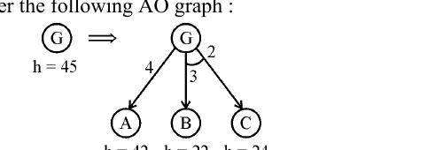

# Question 56

*UGC NET CS · 2017 Jan Paper 3 · Search Techniques · AO* Cost Backup and Node Expansion*

Consider the following AO graph : Which is the best node to expand next by AO* algorithm ?

- **1.** A
- **2.** B
- **3.** C
- **4.** B and C

> [!TIP]
> **Correct answer: 1. A**

## Solution

At G there are two alternatives: the single OR branch to A, and the AND set containing both B and C (shown by the connector). The estimated cost through A is edge 4 + h(A) 42 = 46. The AND alternative costs (3+22)+(2+24)=51 because both B and C must be solved. AO* marks the cheaper current solution graph, so it selects the A branch and expands A next. Option 1 is correct.

## Key Points

- AO*: add edge plus heuristic on an OR branch; sum all connected child costs for an AND branch; expand the frontier of the cheaper marked solution graph.

## Why the other options are incorrect

B or C alone cannot represent the connected AND alternative; both would have to be included, giving cost 51. Option 4 identifies that full alternative, but it is currently more expensive than the A alternative's cost 46.

## Question Figure

