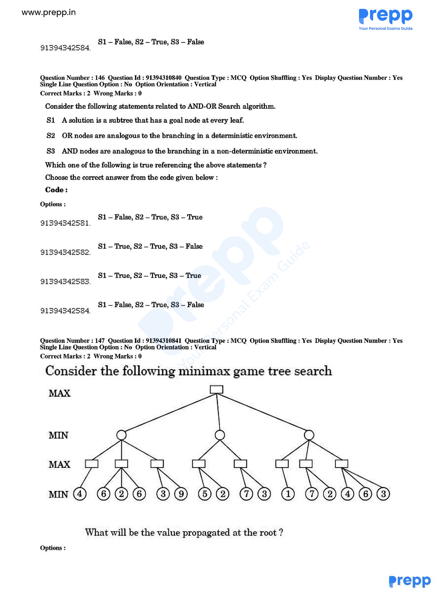

# Question 147

*UGC NET CS · 2018 Dec Paper 1 And 2 · Game Playing · Minimax Value Propagation*

Consider the shown minimax game-tree search. The root is MAX and has three MIN children. The left MIN node has three MAX children with leaf groups [4], [6,2,6], and [3,9]. The middle MIN node has two MAX children with leaf groups [5,2] and [7,3]. The right MIN node has three MAX children with leaf groups [1], [7,2], and [4,6,3]. What value is propagated at the root?

- **1.** 3
- **2.** 4
- **3.** 5
- **4.** 6

> [!TIP]
> **Correct answer: 3. 5**

## Solution

Propagate values upward one level at a time. The left group of MAX nodes evaluates to max(4)=4, max(6,2,6)=6, and max(3,9)=9; its MIN parent therefore gives min(4,6,9)=4. The middle MAX nodes give 5 and 7, so its MIN parent gives 5. The right MAX nodes give 1, 7 and 6, so its MIN parent gives 1. Finally the root is MAX and chooses max(4,5,1)=5. Thus option 3 is correct.

## Key Points

- Evaluate minimax bottom-up, applying MAX or MIN according to the label of the node whose value is being computed.

## Why the other options are incorrect

Values 3, 4 and 6 arise from reading individual leaves or stopping at an intermediate node. Minimax alternates the operator at every level: first MAX over each leaf group, then MIN over each opponent branch, and finally MAX at the root.

## Question Figure

