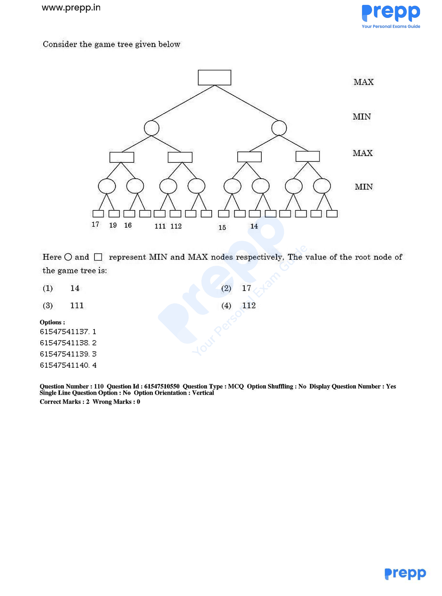

# Question 110

*UGC NET CS · 2019 Dec Paper 1 And 2 · Adversarial Search · Alpha-Beta Pruning*

Consider the MAX/MIN game tree shown in the accompanying figure, evaluated left to right using alpha–beta pruning. Circles and rectangles represent MIN and MAX nodes respectively. What value reaches the root? (In the scan, the terminal-box strokes make 7, 9, 6, 11, 12, 5 and 4 appear as 17, 19, 16, 111, 112, 15 and 14.)

- **1.** 4
- **2.** 7
- **3.** 11
- **4.** 12

> [!TIP]
> **Correct answer: 2. 7**

## Solution

Read the scan's merged labels as 7, 9, 6, 11, 12, 5, and 4. Evaluating left to right, the first bottom MIN node returns min(7,9)=7. The next MIN sees 6, so its remaining child is cut off once its bound is at most the MAX ancestor's 7; that MAX therefore keeps 7. In the other branch of the upper-left MIN, min(11,12)=11 already reaches the MIN ancestor's beta value 7 at a MAX node, so the rest is pruned and the upper-left subtree remains 7. The root now has alpha=7; the right subtree obtains bounds at most 5 and then 4, causing further cutoffs, so it cannot beat 7. The MAX root value is 7, option 2.

## Key Points

- Alpha–beta pruning does not change minimax: MAX raises alpha, MIN lowers beta, and a branch stops when alpha≥beta.

## Why the other options are incorrect

Four and the right-subtree values cannot replace the root's established value 7 because the root is a MAX node. Eleven and twelve occur below a branch controlled by a MIN ancestor whose other child already gives 7, so that ancestor will never choose the larger branch. Treating the scan artifacts as 17, 111, or 112 misreads terminal-box strokes as leading digits.

## Question Figure

