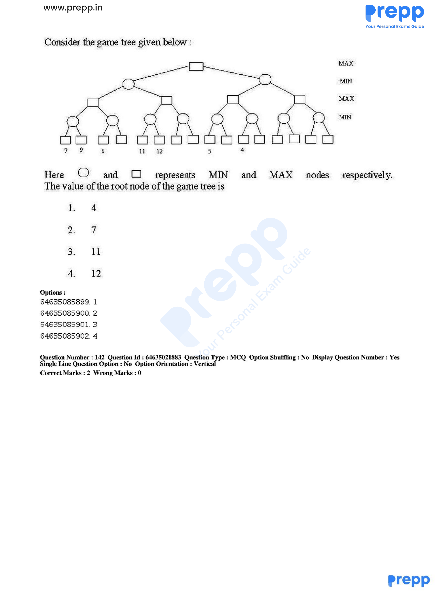

# Question 141

*UGC NET CS · 2019 June Paper 1 And 2 · Approaches to AI · Alpha-beta pruning*

Consider the game tree shown in the accompanying figure. Circles and squares represent MIN and MAX nodes respectively. What is the value of the root node?

- **1.** 4
- **2.** 7
- **3.** 11
- **4.** 12

> [!TIP]
> **Correct answer: 2. 7**

## Solution

Evaluate left to right with alpha-beta minimax. In the left subtree, the first MAX child gets min(7,9)=7. Its sibling begins with min(11,12)=11, already no better for the surrounding MIN node than 7, so the rest is pruned; the left child of the root is 7. The root MAX now has alpha=7. In the right MIN subtree, examined descendants produce upper bounds 5 and 4, so that subtree cannot exceed 7 and its remaining branches are pruned. The root therefore keeps max(7, at most 5)=7.

## Key Points

- Back up MIN/MAX values from the leaves; alpha-beta pruning skips branches that cannot change the final minimax choice.

## Why the other options are incorrect

Values 11 and 12 occur below a MIN choice and cannot pass unchanged to the root. Value 4 is in the right subtree, which cannot improve on the root's established value 7.

## Additional Information

The blank leaves in the figure are branches pruned by the alpha-beta bounds; their values are not needed.

## Question Figure

